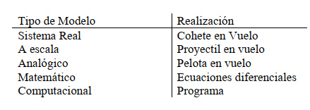
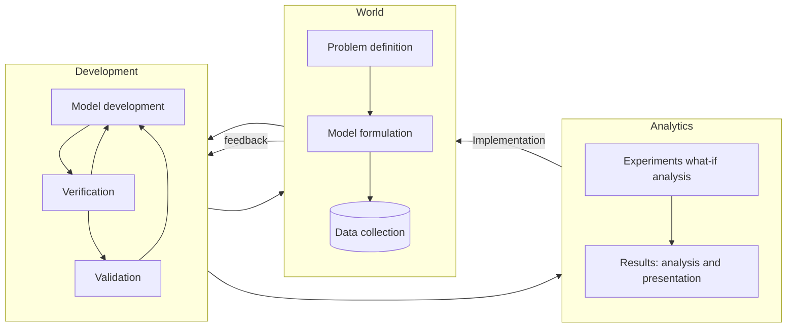
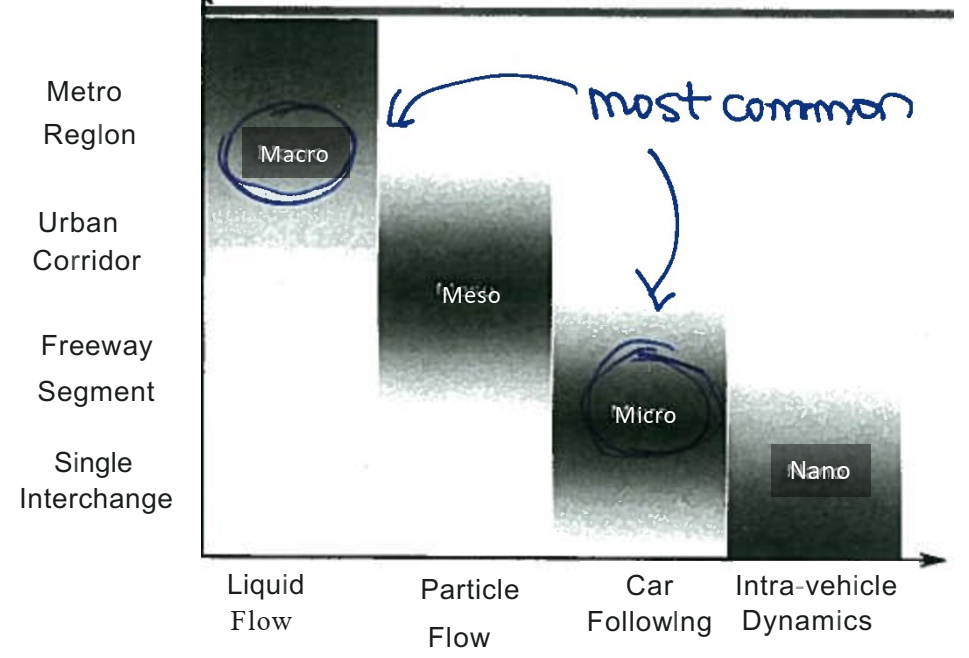

# Sistemas, Modelos y Simulación (intro)

---

## Que es una simulación, ejemplos, por qué simular

1. Def. informal Simulación: Enfoque de modelado (dado un sistema construir un modelo) con el objetivo de aproximar el comportamiento de un sistema
2. 
   1. Ejemplos de modelos con distintos niveles de abstracción:
      1. Modelo de astronomía primitiva (cuerpos celestes visibles sin telescopio: Sol, Luna, Mercurio, Venus, Tierra, Marte, Júpiter, Saturno)
      2. Modelo Ptolemaico (modelo con la tierra como centro)
      3. Modelo Copernicano (primer modelo similar al actual)
      4. Modelo Newtoniano (Leyes de Newton)
      5. Teoría de la Relatividad
3. ¿Por qué simular?
   1. predecir
   2. optimizar
   3. decidir
   4. Comprender los principales conceptos subyacentes de un modelo de simulación permite:
      1. comprender la complejidad
      2. validar rigurosamente de modelos de simulación
      3. analizar estadísticamente de resultados

## Sistemas

1. Estructuras
    1. Entidades
        1. objetos
        2. componentes
    1. Relaciones
2. Procesos
    1. operaciones
    2. acciones
    3. procedimientos
3. Ejemplos
    1. naturales
    2. socio-politicos
    3. tecnológicos
    4. simbólicos y formales

## Sistemas_

4. Sistemas Dinámicos
    1. consideran el tiempo como una dimensión
    2. Sistema dinámico estacionario. la estructura del sistema no cambia y los procesos ocurren en el tiempo pero no se considera la dependencia del tiempo.
    3. Sistema dinámico no-estacionario: la estructura del sistema cambia con el tiempo y los procesos del sistema ocurren en y dependen de el tiempo
    4. a partir de ahora sistema=sistema dinámico.
    5. la def delos físicos es diferente.
5. Medio 
    1. ```mermaid
       graph LR
       subgraph Sistema
         State["Estado del sistema"] 
       end

       Medio --Entradas--> Sistema--Salidas-->Medio
       ```
    2. Estado
    3. interacción -> cambios y transformaciones
    4. Sistema abierto: con medio
    5. Sistema cerrado: sin medio
6. randomness e información
    1. deterministas: cambia el estado con una función determinista
       1. sistemas estacionarios y caóticos
    2. no deterministas: cambia el estado con una función no determinista
    3. inf completa o incompleta

## Modelos

1. abstracción del sistema, una representación
2. permiten
   1. tratar el problema matemática o computacionalmente
   2. observar
   3. controlar
   4. modificar
3. tipos
   1. 

## Simulación

1. Es el proceso mediante el cual los comportamientos de un sistema son observados, modificados o controlados mediante modelos apropiados a tales fines
1. El proceso de simulación puede verse como la ejecución, observación y cambio de un modelo determinado.

## pros y cons

1. Ventajas
    1. Puede ser adecuado para problemas que no son tratables analíticamente.
    2. Mayor nivel de detalle del modelado (no necesariamente significa mayor realismo)
    3. Permite emular experimentos de campo que de otro modo serían costosos , de alto riesgo o inviables.
    4. Análisis hipotético (What-if): procedimiento de prueba y error
    5. Útil para probar la validez de matemáticos (por ejemplo, para validar modelos analíticos)
2. Desventajas
    1. Análisis hipotético: difícil desarrollar relaciones causales
    2. Herramienta matemática computacionalmente costosa (necesita muchas evaluaciones)
    3. El análisis estadístico adecuado de los resultados es complejo
    4. El modelo detallado requiere la formulación y calibración de datos muy detallados.
    5. Calidad de los datos: "entrada y salida de basura"
    6. Difícil de utilizar para realizar la optimización (optimización basada en simulación)
3. Al igual que los modelos analíticos, los modelos de simulación se basan en numerosas suposiciones y aproximaciones, utilícelos con precaución y tenga en cuenta que es una simplificación de la realidad, es decir, ¡un MODELO! (NO CONFUNDIR EL MAPA CON EL TERRITORIO)

## etapas



## tipos de simulación

1. Escala (macro meso micro nano) 
2. paradigma (eventos, agentes, procesos)
3. matemática vs computacional
