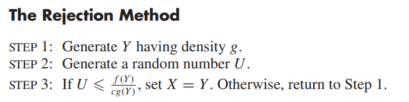

# Generación de Variables Aleatorias, Montecarlo.

## Recap probabilidades.

### VA

### función de probabilidad

### función de densidad e histograma

## Números pseudo-aleatorios

TODO

## Generación de variables aleatorias discretas

- finitas
- infinitas
- integrales con NPA

## Generación de variables aleatorias continuas

### algoritmo de la transformada inversa

-intuición
-$x^n\mathbb{I}_{(0,1)}$

-$1-e^x$
-prueba

### inversa generalizada
-$F^{-1}(u) = \inf\{x: F(x) \geq u\}$

### casos ad-hoc
-gamma

### aceptación rechazo

 -ejemplo gamma fraccionario

###Método de composición
-
## Monte Carlo

## Testing.

